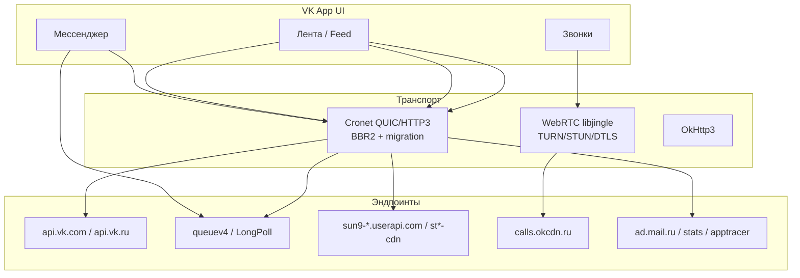

# VK Android APK — полный сетевой аудит

> **APK:** `com.vkontakte.android` **v8.183** (versionCode 54417)  
> **Размер:** 164.7 MB · **DEX:** 17 · **smali:** 17 пакетов · **arm64 libs:** 39  
> **Дата разбора:** 2026-06-19  
> **Источник:** `/root/vk.apk` → apktool + strings по 17 dex + нативные `.so`

Документ для команды WDTT: что делает VK-клиент в сети и что из этого применимо к нашему **серверу** (Xray/роутинг/sysctl) и **клиенту** (TURN/DTLS/воркеры/split-tunnel).

---

## 1. Архитектура сетевого стека

VK не использует один HTTP-клиент — три параллельных транспорта:

| Слой | Библиотека | Назначение |
|------|------------|------------|
| **REST API** | `libcronet.140.0.7339.52.so` (Chromium Cronet) | API-запросы, QUIC/HTTP3, BBR2, connection migration |
| **Звонки / медиа** | `libjingle_peerconnection_so.so` (WebRTC) | TURN Allocate, STUN binding, DTLS-SRTP, consent freshness |
| **Legacy / вспомогательный** | OkHttp3 (`smali_classes11/okhttp3`) | часть SDK, fallback |
| **VK auth HTTP** | tls-client + Chrome TLS fingerprint (`vk_dns.go` у нас) | captcha/login с обходом DPI |

**Вывод для WDTT:** наш клиент архитектурно ближе к **WebRTC/TURN** (WG-over-TURN), а браузерный vk.com — к **Cronet/API/CDN**. Split-tunnel должен разделять оба мира.

---

## 2. Нативные библиотеки (arm64-v8a)

| Библиотека | Роль | Релевантность WDTT |
|------------|------|-------------------|
| `libcronet.140.0.7339.52.so` | QUIC, HTTP3, BBR2, NetworkChangeNotifier | **Сервер:** BBR sysctl. **Клиент:** слушатель смены сети |
| `libjingle_peerconnection_so.so` | WebRTC: ICE, STUN keepalive, consent, TURN Allocate | **Клиент:** consent-freshness, RTT-скоринг relay |
| `libnative-net.so` | VK сетевой слой (обёртки) | низкая |
| `libvkcore.so`, `libvkmedia.so` | медиа/ядро VK | низкая (Opus, не транспорт) |
| `librtmp-jni.so` | RTMP стриминг (live) | не наш сценарий |
| `libcrashlytics*.so` | Firebase crash | блокируется Xray — ожидаемо |
| `libtrhook2.so`, `libxhook.so` | хуки / трассировка | не применимо |
| `libtensorflowlite*.so` | ML on-device | не применимо |

### Ключевые строки из Cronet (подтверждено strings)

- `migrate_idle_sessions`, `idle_session_migration_period_seconds`
- `retry_on_alternate_network_before_handshake`
- `NetworkChangeNotifier`, `NotifyObserversOfNetworkChangeImpl`
- `FLAGS_quic_bbr2_*`, `FLAGS_quiche_reloadable_flag_quic_default_to_bbr`
- `Cronet_QuicHint_*`, `Cronet_EngineParams_enable_quic_*`

### Ключевые строки из libjingle (WebRTC)

- `stunKeepaliveRequestsSent`, `stunKeepaliveRttTotal`
- `getIceConnectionReceivingTimeout`, `getStunCandidateKeepaliveInterval`
- `consentRequestsSent` — **consent freshness** (путь мёртв без ответа)
- `STUN binding request timed out`
- `Set ICE receiving timeout to`

---

## 3. Network Security Config

Файл: `res/xml/network_security_config.xml`

- **Trust anchors:** system CA + `@raw/russian_trusted_root_ca` (сертификат Минцифры РФ)
- **Cleartext разрешён** только для carrier Mobile ID:
  - `mobileid.megafon.ru`, `idgw.mobileid.mts.ru`, `he-mc.tele2.ru`, `beeline.ru`

**Для WDTT:** если клиент/панель ходит на домены с российским CA — может понадобиться trust store (P2 в аудите). Сейчас подписка идёт по HTTPS панели, не VK.

---

## 4. Домены и эндпоинты (из 17 dex, 122 уникальных хоста)

### 4.1 API и авторизация

| Хост | Назначение |
|------|------------|
| `api.vk.com`, `api.vk.ru`, `api.vk.me` | основной REST API (`/method/*`, `execute`) |
| `oauth.vk.com` | OAuth / blank redirect |
| `id.vk.com`, `id.vk.ru` | VK ID |
| `m.vk.com`, `m.vk.ru` | мобильная веб-версия |
| `clientapi.mail.ru` | Mail.ru client API + tracer |

Примеры URL из dex:
- `https://api.vk.ru/ping.txt` — health check
- `https://api.vk.ru/method/account.getGeoByIp`
- `https://api.vk.com/method/execute`
- `https://api.vk.com/oauth/authorize`

**Наши CIDR:** `87.240.128.0/18`, `87.240.192.0/19`, `93.186.224.0/19`

### 4.2 LongPoll / очереди (лента, IM, каналы)

Классы в dex (не хосты — логика в рантайме):
- `LongPollCall`, `LongPollMode`, `QueueSyncComponent`
- `MessagesLongpollParamsDto`, `ChannelsLongPollApiCmd`
- `SuperAppQueueGetEventsLongPollCmd`
- Метрики: `app_first_longpoll_connection`, `first_longpoll_end_connection`

Хосты `queuev4.vk.com` / `queuev4.vk.ru` **не в явном виде в dex** (динамическая выдача через API), но подтверждены DNS и нашим `vk_dns.go`:
- IP: `93.186.237.x`, `95.213.56.x` → подсеть `93.186.224.0/19`, `95.213.0.0/18`

**Симптом «скелетон ленты»:** HTML vk.com грузится, а LongPoll/API queue — через TURN → таймаут. Исправлено расширением split-CIDR (v0.3.23).

### 4.3 CDN медиа (userapi / sun9)

| Паттерн | Примеры |
|---------|---------|
| `sun9-NN.userapi.com` | 50+ шардов (`sun9-2` … `sun9-75`) |
| `pp.userapi.com` | превью |
| Regex в dex | `$^https://[a-z0-9\-.]+\.userapi.com.?` |

Контент: фото/видео ленты, аватары. IP-диапазоны динамические; часть попадает в `93.186.224.0/19`.

### 4.4 Звонки / TURN / OK CDN

| Хост | Назначение |
|------|------------|
| `calls.okcdn.ru` | основной calls CDN / TURN relay |
| `calls-test.okcdn.ru` | тест |
| `api.okcdn.ru`, `uvapi.okcdn.ru` | API OK CDN |
| `api.ok.ru`, `connect.ok.ru` | OK API (наследие) |

**Наши transport CIDR (всегда напрямую):** `90.156.0.0/16`, `95.163.0.0/16`, `155.212.192.0/20`

> TURN IP воркеров пинятся отдельными `/32` — не попадают под «VK через туннель».

### 4.5 Аналитика / реклама / краши (ожидаемо блокируются)

| Хост | Ошибка в браузере |
|------|-------------------|
| `sdk-api.apptracer.ru` | `ERR_CONNECTION_CLOSED` |
| `stats.vk-portal.net` | HTTP 403 |
| `ads.vk.com` | `ERR_CONNECTION_CLOSED` |
| `ad.mail.ru`, `trk.mail.ru` | трекинг |

**Не критично для ленты** — это телеметрия. Блокировка Xray нормальна.

### 4.6 Экосистема VK (не core feed)

`com.vk.video`, `money.mail.ru`, `maps.vk.com`, `team.vk.com`, `away.vk.com`, `sportmailru.*`

---

## 5. Разрешения (сетевые)

Из 99 `uses-permission`, критичные для сети:

- `INTERNET`, `ACCESS_NETWORK_STATE`, `ACCESS_WIFI_STATE`
- `CHANGE_NETWORK_STATE`, `CHANGE_WIFI_STATE` — реакция на смену сети
- `FOREGROUND_SERVICE*` — фоновые LongPoll/звонки

Cross-app queries: `com.vk.calls`, `com.vk.im`, `ru.ok.android`, carrier apps (silent auth).

---

## 6. Поведение, важное для WDTT

### 6.1 Connection migration (Cronet)

При смене Wi-Fi ↔ LTE Cronet:
1. `NetworkChangeNotifier` ловит событие
2. `migrate_idle_sessions` / `retry_on_alternate_network_before_handshake`
3. QUIC-сессия переезжает без полного рестарта приложения

**WDTT v0.3.28:** аналог — `netwatch` (netlink / `NotifyAddrChange`) + полный reconnect при смене шлюза.

### 6.2 Consent freshness (WebRTC)

STUN binding каждые несколько секунд; если нет ответа — путь «мёртв», ICE пересобирается.

**WDTT v0.3.29:** DTLS keepalive 10 c + `consentTimeout` 30 c → убийство зомби-воркера.

### 6.3 Relay health / RTT (уже было)

`relay_health.go`: EWMA жизни сессии + EWMA RTT TURN Allocate → `pickHealthyTurnURL`.

### 6.4 BBR на сервере

**installer v1.4.50:** `net.core.default_qdisc=fq`, `tcp_congestion_control=bbr`.

### 6.5 Split tunnel

| Группа | CIDR | Режим |
|--------|------|-------|
| TURN transport | 90.156/16, 95.163/16, 155.212.192/20 | **всегда direct** |
| Web/API/CDN | 87.240/18, 93.186/19, 95.142/19, … | direct по умолчанию; опция «VK через туннель» (v0.3.27) |

---

## 7. Матрица «APK → WDTT»

| Находка в APK | Статус в WDTT | Версия |
|---------------|---------------|--------|
| BBR / fq congestion | ✅ `setup_sysctl` | installer 1.4.50 |
| NetworkChangeNotifier | ✅ `netwatch_*` | client 0.3.28 |
| Consent freshness | ✅ `consentTimeout` + `lastInbound` | client 0.3.29 |
| RTT-based relay pick | ✅ `relay_health.go` | было раньше |
| QUIC/Cronet целиком | ❌ не нужно | — |
| Split API/CDN vs TURN | ✅ `vkWebCIDRs` / `vkTransportCIDRs` | 0.3.23–0.3.27 |
| Static DNS fallback | ✅ `vk_dns.go` | 0.3.23 |
| Российский CA в trust store | ⏳ не сделано | P2 |
| Pre-resolve sun9-* CDN шардов | ⏳ частично (CIDR) | P2 |
| TURN consent на уровне STUN Binding (не DTLS) | ⏳ можно усилить | P3 |

---

## 8. Рекомендации на будущее

1. **Периодический re-resolve** `queuev4`, `calls.okcdn.ru`, `api.vk.ru` — IP меняются, CIDR покрывают широко, но новые подсети возможны.
2. **Мониторинг** `stats.vk-portal.net` / `apptracer` — не чинить в split; пользователям объяснять что это не лента.
3. **STUN-level keepalive** на TURN Client (`tc.SendBindingRequest` уже 10 c в session.go) — можно связать с consent отдельно от DTLS pong.
4. **sun9-*.userapi.com** — при жалобах на медиа добавить wildcard-resolve или расширить `95.142.192.0/19`.

---

## 9. Файлы разбора

| Путь | Содержание |
|------|------------|
| `/root/vk.apk` | оригинал |
| `/root/vk-apk-analysis/raw/` | распакованные dex + manifest |
| `/root/vk-apk-analysis/decoded/apktool/` | smali + resources |
| `/root/vk-apk-analysis/vk_audit_data.json` | машиночитаемый дамп (permissions, domains, libs) |
| `/tmp/vk_hosts.txt` | 122 очищенных хоста из dex |

---

*Связанные документы: `docs/CLIENT.md`, `CHANGELOG.md` (0.3.23–0.3.29)*
